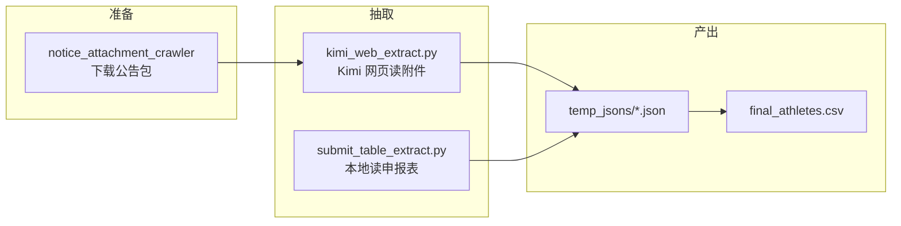

# 足球运动员技术等级信息抽取

从**公示公告包**与**申报推荐表**抽取运动员字段，合并为 **`final_athletes.csv`**。

当前主路线：**公告用 Kimi 网页自动化读附件**（含扫描 PDF）；申报表仍用**本地表格解析**。不再以 `Information_extraction.py` 本地抽公告为主（该脚本已从本仓库移除）。

---

## 整体流程



| 步骤 | 输入 | 脚本 | 输出 |
|------|------|------|------|
| 1（可选） | 官网公告 ID 908–1904 | `notice_attachment_crawler/notice_attachment_crawler.py` | `notice_attachment_crawler/data/<ID>/` |
| 2（主） | 公告包 + `url.txt` | `kimi_web_extract.py` | `temp_jsons/notice__<ID>.json` |
| 3 | `Submit_athletes/*.xlsx` 等 | `submit_table_extract.py` | `temp_jsons/submit__*.json` |
| 4 | 全部 JSON | `extraction_common.merge_jsons_to_csv` | `final_athletes.csv` |

---

## 目录结构

```text
football/
├── notice_attachment_crawler/
│   ├── notice_attachment_crawler.py   # 公告附件下载（908–1904）
│   └── data/<ID>/                     # url.txt、正文、PDF/xlsx 附件
├── kimi_web_extract.py                # 公告 → Kimi 网页抽取（主路径）
├── submit_table_extract.py            # 申报表 → 本地解析
├── extraction_common.py               # 字段定义、JSON → CSV 合并
├── table_parse_core.py                # 表格行解析（申报表用）
├── prompts/notice_kimi_prompt.txt       # Kimi 提示词
├── Submit_athletes/                   # 申报 xlsx/pdf
├── temp_jsons/                        # notice__* / submit__* JSON
├── final_athletes.csv                 # 最终合并表
├── .kimi_chrome_profile/              # Kimi 登录会话（自动生成）
├── kimi_extract_failed_ids.txt        # 待重跑公告 ID
├── kimi_agent_failures.txt            # 失败明细日志
└── requirements.txt
```

---

## 环境与依赖

### 前置条件

| 项目 | 要求 |
|------|------|
| Python | **3.10+**（推荐 3.10～3.12） |
| 浏览器 | **Google Chrome**（Kimi 自动化使用本机 Chrome，不下载 Playwright 自带 Chromium） |
| 网络 | `pip install`、Kimi 网页、公告下载 API |

### 安装

在项目根目录执行：

```powershell
cd D:\homework\football
python -m pip install --upgrade pip
python -m pip install -r requirements.txt
```

| 包 | 用途 |
|----|------|
| `playwright` | 驱动本机 Chrome 操作 Kimi |
| `pandas` / `openpyxl` / `xlrd` | 申报表 xlsx |
| `pdfplumber` / `pymupdf` | 申报表 PDF 表格 |
| `python-docx` | docx（申报/公告本地辅助） |

公告爬虫额外需要（在 `notice_attachment_crawler` 目录使用时）：

```powershell
python -m pip install requests beautifulsoup4 lxml
```

### 验证

```powershell
python -c "import pandas, playwright; print('依赖 OK')"
python -c "from kimi_web_extract import list_notice_folders; print(len(list_notice_folders(from_id=908,to_id=910)), '个公告包')"
```

**不需要** DeepSeek/OpenAI 等 API Key；Kimi 通过浏览器会话访问 [kimi.com](https://www.kimi.com/)（快速模型，勿进 `/agent`）。

---

## 一、下载公告包（可选）

若已有 `notice_attachment_crawler/data/<ID>/` 可跳过。

```powershell
cd notice_attachment_crawler
python notice_attachment_crawler.py
```

每个 `<ID>/` 通常含：`url.txt`、正文 txt、附件（pdf/xlsx/docx 等）。下载器自带 `progress.json` 断点续传。

---

## 二、Kimi 批量抽取公告（主路径）

### 首次：登录 Kimi

须**有界面**（保存 Cookie 到 `.kimi_chrome_profile/`）：

```powershell
python kimi_web_extract.py --login
```

在 Chrome 中登录 [Kimi 首页](https://www.kimi.com/) 后，回到终端按 Enter。

### 批量运行（推荐）

**默认无头、不写 debug 截图/txt**；单条失败不中断整批；已成功 JSON 自动跳过。

```powershell
# 可选：指定 Chrome 路径
$env:KIMI_CHROME_PATH = "C:\Program Files\Google\Chrome\Application\chrome.exe"

# 908–1904（仅处理 data 下已存在的文件夹）
python kimi_web_extract.py --from-id 908 --to-id 1904 --delay 5

# 仅重跑失败 ID
python kimi_web_extract.py --from-id 908 --to-id 1904 --retry-failed

# 单条试跑
python kimi_web_extract.py --ids 910
```

### 单条公告在 Kimi 内做什么

1. **新对话** → 收起侧栏 → `+` →「文件和图片」→ 上传该 ID 目录下附件（含 `url.txt`）
2. 填入 `prompts/notice_kimi_prompt.txt`（禁止跑代码，直接读 PDF/表）
3. 点右下角**黑色上箭头**发送（不是 `+`）→ 等到回复末尾 **`COUNT=N`**
4. 解析回复：一段公示 meta JSON + 运动员数组 → 写入 `temp_jsons/notice__<ID>.json`

Kimi 输出格式（脚本据此解析）：

```text
{"来源文件路径":"...","文件ID":"910","授予单位":"..."}
[{ "运动员等级":"...", "姓名":"...", ... }, ...]
COUNT=35
```

### 断点续跑与失败记录

| 机制 | 说明 |
|------|------|
| 默认 `--skip-existing` | 已有有效 `notice__<ID>.json` 则跳过 |
| 失败不写 JSON | 该 ID 记入 `kimi_extract_failed_ids.txt` |
| 失败不中断 | 继续下一个 ID；明细在 `kimi_agent_failures.txt` |
| `--retry-failed` | 只重跑失败列表中的 ID（仍受 `--from-id`/`--to-id` 限制） |
| `--force` | 覆盖已有 JSON，全部重跑 |

中断后**再次执行同一条批量命令**即可从断点继续。

### Kimi 参数一览

| 参数 | 说明 |
|------|------|
| `--login` | 登录 Kimi（有界面） |
| `--from-id` / `--to-id` | 批量 ID 范围 |
| `--ids` | 逗号分隔指定 ID |
| `--retry-failed` | 仅重跑 `kimi_extract_failed_ids.txt` |
| `--skip-existing` | 跳过已成功（**默认开启**） |
| `--force` / `--no-skip-existing` | 强制重跑 |
| `--headed` | 显示 Chrome（默认**无头**） |
| `--debug` | 写入 `kimi_debug/`（回复 txt、截图；**默认关闭**） |
| `--delay` | 每条间隔秒数（默认 3） |
| `--timeout` | 等待 `COUNT=` 最长时间（默认 300 秒） |
| `--skip-upload` | 跳过上传（对话里已手动放好附件时用） |
| `--merge-only` | 仅合并 `temp_jsons` → CSV |
| `--inspect-ui` | 导出页面控件清单（校准选择器） |

### 调试（排错时）

```powershell
python kimi_web_extract.py --ids 910 --headed --debug
```

---

## 三、申报表本地解析

```powershell
python submit_table_extract.py
python submit_table_extract.py --skip-existing
python submit_table_extract.py --merge-only
```

读取 `Submit_athletes/` 下 `.xlsx` / `.xls` / `.pdf`，输出 `temp_jsons/submit__<文件名>.json`，默认结束后合并 CSV。

---

## 四、合并为 CSV

公告与申报 JSON 都就绪后：

```powershell
python kimi_web_extract.py --merge-only
# 或
python submit_table_extract.py --merge-only
```

生成 **`final_athletes.csv`**（UTF-8 BOM，字段见 `extraction_common.CSV_FIELDS`，自动去重）。

---

## 五、推荐一次跑通

```powershell
# 1. 依赖 + Kimi 登录（仅首次）
python -m pip install -r requirements.txt
python kimi_web_extract.py --login

# 2. 公告批量（无头、断点续跑）
python kimi_web_extract.py --from-id 908 --to-id 1904 --delay 5

# 3. 申报表
python submit_table_extract.py --skip-existing

# 4. 若第 2/3 步未自动 merge，再执行
python kimi_web_extract.py --merge-only
```

失败 ID 处理：查看 `kimi_extract_failed_ids.txt` → `python kimi_web_extract.py --from-id 908 --to-id 1904 --retry-failed`

---

## 六、输出文件

| 路径 | 说明 |
|------|------|
| `temp_jsons/notice__<ID>.json` | 公告运动员名单（12 字段/人） |
| `temp_jsons/submit__*.json` | 申报表解析结果 |
| `final_athletes.csv` | 合并总表 |
| `kimi_extract_failed_ids.txt` | 待重跑公告 ID |
| `kimi_agent_failures.txt` | Kimi 失败时间 + 原因 |
| `kimi_debug/` | 仅 `--debug` 时生成 |

---

## 七、常见问题

| 现象 | 处理 |
|------|------|
| `请先 --login` | 执行 `python kimi_web_extract.py --login` |
| 以为已发送但未生成 | 用 `--headed --debug` 看是否点到黑色发送钮；须见到 `COUNT=` |
| 保存条数是 COUNT 两倍 | 已修复重复解析；删除错误 JSON 后重跑该 ID |
| `ImportError: NOTICE_META_FIELDS` | 确保 `extraction_common.py` 含 `NOTICE_META_FIELDS` |
| pip 慢 | `python -m pip install -r requirements.txt -i https://pypi.tuna.tsinghua.edu.cn/simple` |
| 找不到 Chrome | 设置 `$env:KIMI_CHROME_PATH` 为 `chrome.exe` 完整路径 |
| 某 ID 反复失败 | 看 `kimi_agent_failures.txt`；`--retry-failed` 单独重跑 |

---

## 八、其它脚本（非主流程）

| 脚本 | 说明 |
|------|------|
| `notice_attachment_crawler/notice_attachment_crawler.py` | 从官网 API 下载公告正文与附件 |
| `sport_level_crawler/sport_level_crawler.py` | 体育总局等级查询（独立数据源，非本合并流程必需） |

---

## 实现路线说明（与旧版差异）

| 旧思路 | 现思路 |
|--------|--------|
| 公告 PDF/xlsx **本地抽表**（`Information_extraction.py`） | 公告包 **上传 Kimi**，由网页模型直接读附件（尤其扫描件） |
| 依赖复杂本地 PDF 管线 + 手工 `manual_fix` 为主 | 自动化批处理 + `failed_ids` 重试；手工仅作兜底 |
| 需 LLM API Key | **无需 API**；Playwright 操作已登录的 Kimi 网页 |
| 默认有界面、易生成大量 debug 文件 | **默认无头**；`--debug` 才写 `kimi_debug/` |

申报表结构规整，仍适合 **pandas + pdfplumber** 本地解析，与公告路径并行，最后统一合并。
